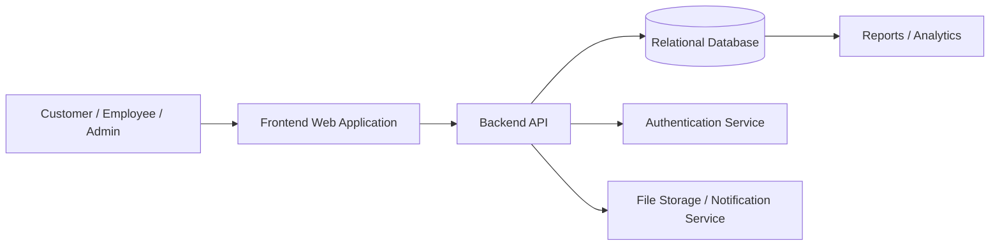

# GenesisConnect – Smart Business Management Platform

GenesisConnect is a smart business management platform developed for Genesis Power Equipment Limited to streamline operations, improve service delivery, and bring all core business activities into a single digital workflow. The platform is designed to replace disconnected manual processes with a centralized system for customer management, service tracking, quotations, invoices, employee coordination, and management reporting.

> Repository status: The current workspace contains the project documentation and planning foundation for GenesisConnect. The full application codebase, database schema, and deployment files are not yet present in this repository. The sections below are therefore written as a professional business and technical specification for the system and clearly separate implemented repository content from planned application features.

## 1. Project Title

GenesisConnect – Smart Business Management Platform

## 2. Project Overview

GenesisConnect is intended to serve as a digital business platform for a company like Genesis Power Equipment Limited, where daily operations depend on customer engagement, equipment-related service work, quotations, invoicing, employee assignment, and operational reporting.

The platform brings together core business functions into one place so that:

- Customers can submit requests and track updates
- Employees and technicians can manage assigned service work
- Admins can monitor operations and approve workflows
- Management can view business performance and service trends
- Quotations and invoices stay connected to the actual service lifecycle

This reduces the reliance on manual records, fragmented communication, and delayed follow-ups.

## 3. Problem Statement

Most operational challenges in service-driven businesses come from manual and fragmented processes. Genesis Power Equipment Limited, like many similar companies, can face the following issues:

- Customer information is scattered across paper forms, messages, spreadsheets, and personal records.
- Service requests are hard to track consistently and may be missed or duplicated.
- Quotation and invoice records are not always aligned with the actual service performed.
- There is no unified source of truth for customer, service, and business history.
- Communication between the customer, admin, and technician teams is inconsistent.
- Managers struggle to monitor workload, completion status, and business performance.
- Manual workflows slow down operations and create accountability .

GenesisConnect is designed to solve these problems by digitizing and centralizing the workflow.

## 4. Objectives

The project objectives are to:

- Digitize business operations and reduce dependence on manual recordkeeping.
- Centralize customer, employee, service, quotation, and invoice data.
- Improve service request tracking from creation to closure.
- Automate quotation and invoice workflows.
- Improve employee and technician productivity through better task assignment and tracking.
- Provide analytics and management reports for smarter decisions.
- Improve customer experience by enabling faster communication and clearer follow-up.
- Build a scalable platform that can eventually support additional branches or business units.

## 5. Current Repository Status

The repository is currently at an early documentation and planning stage. It contains project context, business requirements, and a conceptual roadmap, but it does not yet include a full implementation of the application.

This means the README must clearly distinguish:

- Implemented in the repository: documentation and planning materials
- Planned or future implementation: application features, architecture, and system modules

## 6. Implemented Features

The following features are present in this repository as actual documented project content:

| Feature Area | Status | Details |
| --- | --- | --- |
| Project overview | Implemented | Business purpose and target audience are documented. |
| Problem statement | Implemented | Operational issues and manual workflow limitations are described. |
| Project objectives | Implemented | Goals and intended outcomes are defined. |
| Business value narrative | Implemented | Entrepreneurial and operational value are explained. |
| Project documentation | Implemented | Documentation foundation exists in the repository. |
| Repository planning structure | Implemented | The project is organized around a clear concept and roadmap. |

## 7. Planned and Future Features

The platform described by GenesisConnect includes several major areas of functionality that are intended for future implementation.

### 7.1 Public Website
- Landing page for the company and platform
- Service overview and product categories
- Contact and inquiry form
- About us and brand trust-building content
- CTA sections for leads and service requests

### 7.2 Customer Portal
- Customer login and profile management
- Service request submission
- Request status tracking
- Quotation and invoice history
- Communication with support/admin

### 7.3 Admin Dashboard
- Overview metrics and KPI summary
- Customer and employee management
- Service request assignment
- Quotation and invoice controls
- Reporting and operational insights

### 7.4 Employee / Technician Dashboard
- Assigned work orders
- Status updates and checklists
- Service completion and notes
- Productivity tracking and task history

### 7.5 Customer Management
- Customer master data
- Purchase and service history
- Contact and communication records
- Client account notes and preferences

### 7.6 Service Request Management
- Create and assign service tickets
- Priority-based handling
- Status flow from new to completed
- Notes, attachments, and resolution tracking

### 7.7 Product / Service Management
- Product and service catalog
- Pricing and packages
- Equipment and spare part management
- Service rate configuration

### 7.8 Quotation Management
- Generate quotations for customer requests
- Approvals and revisions
- Quote-to-invoice linkage
- PDF export or shareable documents

### 7.9 Invoice Management
- Generate invoices from approved work
- Track payments and due dates
- Invoice history and payment status
- Billing summaries and outstanding amounts

### 7.10 Notifications
- Email reminders
- SMS or WhatsApp notifications
- Service update alerts
- Payment and follow-up reminders

### 7.11 Analytics
- Service volume trends
- Revenue summaries
- Customer and technician reporting
- Operational performance dashboard

### 7.12 Authentication & Authorization
- Secure role-based login
- Customer, employee, and admin access control
- Protected routes and permission validation

## 8. Technology Stack

Because the actual codebase is not yet present in the repository, the technology stack below reflects the intended implementation plan rather than a confirmed runtime inventory.

| Layer | Technology | Notes |
| --- | --- | --- |
| Frontend | React or Next.js | Modern UI for customers, dashboards, and workflow screens |
| Backend | Node.js with Express or NestJS | API layer and business logic |
| Database | PostgreSQL or MySQL | Core data persistence |
| ORM / Data Access | Prisma, Sequelize, or TypeORM | Structured database access |
| Authentication | JWT, bcrypt, session handling | Secure login and role enforcement |
| API Style | RESTful JSON API | Human-readable, modular API design |
| File Storage | Local storage, S3-compatible storage, or Cloudinary | For uploads and reports |
| Email / Notifications | SMTP, SendGrid, or Twilio-like service | Alerts and reminders |
| Deployment | Vercel, Render, Railway, Docker, or cloud hosting | Production deployment support |
| Development Tools | VS Code, Git, npm/yarn, ESLint, Prettier | Standard development workflow |

## 9. System Architecture

GenesisConnect is designed as a typical web application architecture:

1. Users access the frontend through a web interface.
2. The frontend calls backend APIs for authentication, business operations, and reports.
3. The backend validates requests and enforces role-based permissions.
4. Data is stored in a relational database.
5. Notification and file storage services support communication and document workflows.

### 9.1 Architecture Diagram



### 9.2 Architectural Expectations

- Frontend is responsible for dashboards, forms, and customer interactions.
- Backend contains business logic and secure APIs.
- Database stores all core records and relational data.
- Authentication handles user identity and permission checks.
- File and notification services help with uploads, reminders, and communication.

## 10. System Modules

The intended system is expected to be organized into major modules:

### 10.1 Authentication Module
Handles login, registration, JWT management, password hashing, and authorization.

### 10.2 Customer Module
Stores customer details, service history, and communication records.

### 10.3 Service Request Module
Tracks issue submission, assignment, status transitions, and completion.

### 10.4 Product and Service Module
Defines products, pricing, service categories, and maintenance offerings.

### 10.5 Quotation Module
Creates, updates, and tracks customer quotations and approvals.

### 10.6 Invoice Module
Generates and tracks invoices, payment status, and outstanding balances.

### 10.7 Employee Module
Manages staff and technician profiles, tasks, and assigned work.

### 10.8 Admin Module
Provides supervision, workflow management, and reporting access.

### 10.9 Analytics Module
Aggregates business performance, service totals, and trend analysis.

### 10.10 Notification Module
Handles reminders, communication alerts, and task updates.

## 11. User Roles

The application is expected to support multiple user roles, each with different permissions.

| Role | Responsibilities | Typical Access |
| --- | --- | --- |
| Customer | Submit service requests, track requests, view quotations and invoices | Own records only |
| Employee / Technician | Receive assigned work, update progress, document completion | Assigned tasks and related data |
| Administrator | Manage users, approve work, review reports, maintain operational data | Full system access |

## 12. Project Workflow

A typical workflow for GenesisConnect would look like this:

1. Customer raises a request or inquiry.
2. Request is reviewed by the admin team.
3. A service ticket is created and assigned to the relevant employee or technician.
4. Technician updates work progress and completion status.
5. Admin verifies the results and ensures required documentation is complete.
6. Final report is prepared, and a quotation or invoice is generated if needed.
7. Customer receives the update, resolution, billing info, or communication summary.

This creates a complete service lifecycle from request to resolution.

## 13. Database

The actual database implementation is not yet present in the repository. Based on the intended business logic, the system would include major entities such as:

| Entity | Purpose |
| --- | --- |
| User | Stores login credentials, roles, and account metadata |
| Customer | Contains customer profile and contact information |
| Employee | Stores employee and technician details |
| ServiceRequest | Tracks service issue, status, assignment, and resolution |
| Product | Stores product catalog details |
| Service | Stores service types and pricing |
| Quotation | Records price estimates and approval history |
| Invoice | Stores billing information and payment status |
| Notification | Stores reminders and communication records |
| AuditLog | Tracks important operational changes |
| Report | Stores summary and business performance data |

## 14. API Documentation

No backend API code is currently present in the repository. The following endpoints reflect the intended API surface for the project when the backend is implemented.

| Method | Endpoint | Purpose |
| --- | --- | --- |
| POST | /api/auth/login | Authenticate user and return token |
| POST | /api/auth/register | Register a new customer or employee account |
| GET | /api/customers | Retrieve all customers |
| POST | /api/customers | Create a customer record |
| GET | /api/customers/:id | View a customer profile |
| GET | /api/service-requests | List service requests |
| POST | /api/service-requests | Create a service request |
| PATCH | /api/service-requests/:id/status | Update request status |
| GET | /api/quotations | Retrieve quotations |
| POST | /api/quotations | Create a quotation |
| GET | /api/invoices | Retrieve invoices |
| POST | /api/invoices | Generate invoice |
| GET | /api/employees | Retrieve employee records |
| GET | /api/reports/summary | Fetch summary analytics |

## 15. Installation & Setup

The application is not yet implemented in this repository, so the installation steps below are a project-ready guide for future setup.

### 15.1 Prerequisites

- Node.js 18 or later
- npm or yarn
- PostgreSQL or MySQL
- Git
- VS Code or any preferred editor
- Optional: Docker for local containerized development

### 15.2 Repository Setup

```bash
git clone <repository-url>
cd GenesisConnect
```

### 15.3 Frontend Setup

```bash
cd frontend
npm install
cp .env.example .env
npm run dev
```

### 15.4 Backend Setup

```bash
cd backend
npm install
cp .env.example .env
npm run migrate
npm run dev
```

### 15.5 Database Setup

- Create a PostgreSQL or MySQL database
- Update environment variables with the correct database credentials
- Run migrations to build the schema

Example migration commands:

```bash
npm run migrate
npm run seed
```

### 15.6 How to Start the Project

- Frontend: `npm run dev` in the frontend directory
- Backend: `npm run dev` in the backend directory
- Database: ensure it is running and reachable before starting backend services

## 16. Environment Variables

A sample environment file should follow this structure without exposing secrets:

```env
# App configuration
NODE_ENV=development
PORT=5000
APP_NAME=GenesisConnect

# Frontend
NEXT_PUBLIC_API_URL=http://localhost:5000/api

# Database
DB_HOST=localhost
DB_PORT=5432
DB_NAME=genesisconnect
DB_USER=postgres
DB_PASSWORD=your_secure_password

# JWT
JWT_SECRET=your_jwt_secret_here
JWT_EXPIRES_IN=7d

# Email / notifications
SMTP_HOST=smtp.example.com
SMTP_PORT=587
SMTP_USER=your_email_user
SMTP_PASSWORD=your_email_password
SMTP_FROM=no-reply@example.com

# Storage
STORAGE_PROVIDER=local
STORAGE_BUCKET=genesisconnect-files
```

> Sensitive values should never be committed to source control. Use a local `.env` file and protect production secrets in a secure environment management system.

## 17. Project Structure

A typical structure for the project would be:

```text
GenesisConnect/
├── README.md
├── .gitignore
├── .env.example
├── frontend/
│   ├── src/
│   ├── public/
│   ├── package.json
│   └── .env.example
├── backend/
│   ├── src/
│   ├── prisma/ or migrations/
│   ├── package.json
│   └── .env.example
├── docs/
│   ├── architecture.md
│   ├── api.md
│   └── business-requirements.md
├── tests/
│   ├── unit/
│   ├── integration/
│   └── e2e/
└── deployment/
    ├── docker-compose.yml
    └── nginx.conf
```

### Purpose of Key Folders

- `frontend/`: user interface and dashboard experience
- `backend/`: API logic, validation, and business rules
- `docs/`: architecture and business requirements documentation
- `tests/`: validation and regression coverage
- `deployment/`: deployment scripts and infrastructure templates

## 18. Testing

No formal automated test suite is present in the current repository. When the project is implemented, testing should include:

- Unit tests for business logic and validation
- Integration tests for API endpoints and database interaction
- Role-based access tests for customer, employee, and admin workflows
- UI tests for form handling, routing, and dashboard states

Example commands:

```bash
npm run test
npm run test:watch
npm run test:coverage
```

## 19. Deployment

GenesisConnect can be deployed using a cloud-first or container-based setup, such as:

- Frontend hosted on Vercel or similar static hosting platform
- Backend hosted on Render, Railway, or a cloud VM
- Database hosted on a managed PostgreSQL or MySQL instance
- File uploads stored using object storage or a secure storage backend
- Containers used for consistent deployment across environments

Production setup should include:

- HTTPS enforcement
- Environment-based configuration
- Monitoring and logging
- database backups
- secure secret management

## 20. Security

Security is a critical requirement for any customer-facing business system. The intended implementation should include:

- Strong password hashing and storage practices
- JWT-based authentication with secure token handling
- Role-based authorization for customer, employee, and admin users
- Input validation for all API requests
- Protection against common web vulnerabilities
- Environment variables for secrets and platform configuration
- Audit logs for sensitive business actions
- HTTPS for all production traffic

## 21. Entrepreneurship / Business Value

GenesisConnect is a strong entrepreneurship project because it addresses a real operational challenge faced by growing service businesses. It is not just a technical exercise; it solves a practical business problem.

For Genesis Power Equipment Limited, the value includes:

- Reduced manual administrative work
- Better service request visibility and accountability
- Faster customer communication and follow-up
- More consistent quotation and invoice management
- Easier employee and technician coordination
- Better management insight through reporting and analytics

The platform can also be commercialized. Similar businesses in the service, maintenance, industrial equipment, and support sectors could adopt and adapt a version of GenesisConnect. Over time, the platform can evolve into a SaaS-style product for service-driven businesses.

## 22. Future Enhancements

The platform has strong potential for expansion beyond the initial scope. Realistic future additions include:

- AI-powered customer support chatbot
- Predictive maintenance and equipment health tracking
- Mobile app for customers and technicians
- Online payment integration
- IoT-based equipment monitoring
- WhatsApp or SMS automation
- Advanced analytics and forecasting
- Multi-branch support and centralized control
- ERP integration with accounting and procurement tools

## 23. Screenshots

No application screenshots are currently available in this repository. The following placeholders indicate the types of views that should be captured once the product is built.

### Placeholder Screenshots


## 24. Contributors

The repository currently identifies the following contributor/owner:

- PraveenaMurugesan-tech

No additional contributor names are present in the current repository state.

## 25. License

No license file is currently present in this repository. At this stage, the project is effectively unlicensed. Before public release or commercialization, a formal license should be added based on the intended distribution model.

## 26. Summary

GenesisConnect is a practical digital transformation project designed to improve the way Genesis Power Equipment Limited handles customer service, internal operations, quotations, billing, and reporting. The project is currently in a documentation and planning phase, but it has clear business value and a realistic technical roadmap.

The repository serves as a strong foundation for a future implementation that can evolve into a complete business management system and, potentially, a broader SaaS product for similar organizations.
