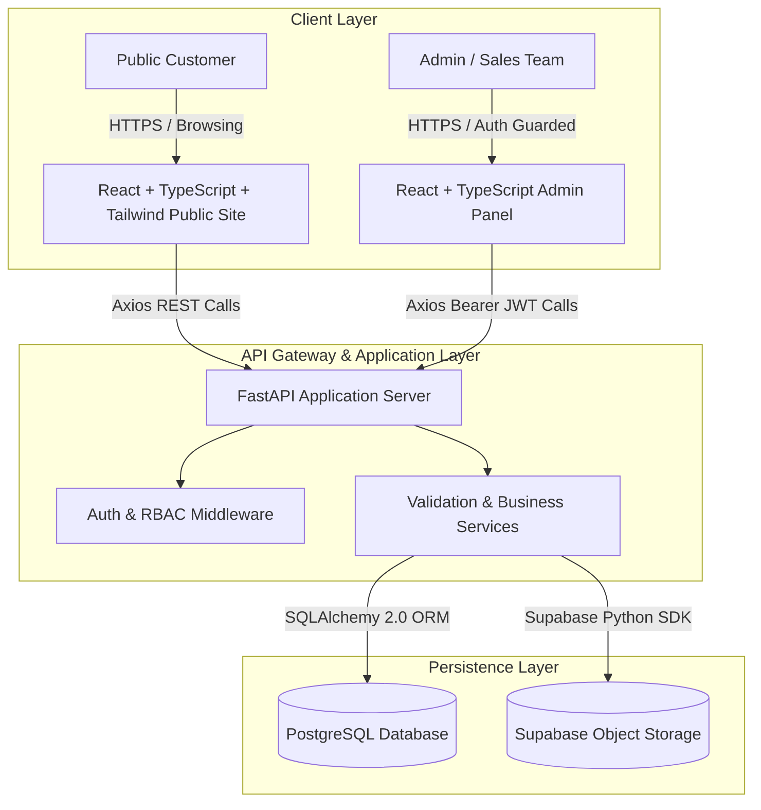

# GenesisConnect System Architecture Specification

## 1. Executive Summary

**GenesisConnect** is the official digital web platform and customer enquiry management system developed for **Genesis Power Equipments Pvt. Ltd.** Genesis Power Equipments specializes in industrial power solutions, generators, energy systems, transformers, and electrical equipment.

GenesisConnect serves two core user groups:
1. **Public Customers & Industrial Clients:** Discover industrial power products, explore services, review specifications/datasheets, request quotations for standard machinery, submit customized technical capacity requirements, and reach out to the engineering team.
2. **Company Administrators & Sales Engineers:** Manage product catalogues, upload product brochures/images, review incoming quotation requests, track custom requirement submissions, and manage communication workflows without touching application code.

---

## 2. High-Level System Architecture

GenesisConnect is architected as a decoupled, modern multi-tier web application designed for high reliability, clean data integrity, and fast performance.



### Architectural Principles

1. **Decoupled Client & Server:** The React frontend communicates strictly over RESTful JSON APIs with the Python FastAPI backend, allowing independent versioning and testing.
2. **Dynamic Database-Driven Content:** Products, services, specifications, and content are managed dynamically in PostgreSQL. No products are permanently hardcoded in the frontend.
3. **Stateless JWT Authentication:** Scalable, token-based authentication using HS256 JWTs with bcrypt password hashing for admin users.
4. **Separation of Relational Data and File Binaries:** Relational records, customer inquiries, and metadata are stored in PostgreSQL; binary files (heavy datasheets, high-res industrial photos, requirement PDFs) are hosted in Supabase Storage with CDN capabilities, storing only secure URL references in PostgreSQL.

---

## 3. Technology Stack Rationale

| Tier | Technology | Rationale |
| :--- | :--- | :--- |
| **Frontend Framework** | React 18 + TypeScript | Industry standard, strong type safety across API contracts, component reusability. |
| **Build Tool** | Vite | Lightning-fast HMR (Hot Module Replacement), optimized production tree-shaking and bundling. |
| **Styling** | Tailwind CSS | Utility-first, responsive design with customized industrial power design tokens (slate, deep blue, electrical amber). |
| **Client Routing** | React Router v6 | Declarative client-side routing supporting public layouts, admin layouts, and route guards. |
| **HTTP Client** | Axios | Request/response interceptors for automatic JWT token injection, centralized error handling. |
| **Backend Framework** | Python 3.11 + FastAPI | Asynchronous performance, automatic OpenAPI / Swagger interactive documentation, Pydantic type enforcement. |
| **Data Validation** | Pydantic v2 | High-speed data serialization and request body validation. |
| **ORM** | SQLAlchemy 2.0 | Explicit 2.0 syntax, type-safe database queries, transactional integrity. |
| **Migrations** | Alembic | Version-controlled database migrations matching SQLAlchemy declarative models. |
| **Database** | PostgreSQL | Robust ACID relational database, JSONB support for dynamic product specifications, strict foreign key constraints. |
| **Storage Engine** | Supabase Storage | S3-compatible, reliable file upload handling with secure bucket policies for public and signed documents. |

---

## 4. Frontend Application Architecture

The frontend follows a modular directory layout:

```text
frontend/
├── src/
│   ├── assets/              # Static branding and icon assets
│   ├── components/          # Reusable shared UI primitives (Buttons, Cards, Inputs)
│   ├── layouts/             # PublicLayout and AdminLayout
│   ├── pages/               # Page components mapped to routes
│   │   ├── admin/           # Admin panel pages
│   │   └── public/          # Public company website pages
│   ├── routes/              # Route configuration and route guards
│   ├── services/            # Axios API instances and service wrappers
│   ├── types/               # TypeScript interfaces matching backend models
│   ├── App.tsx              # Root component with RouterProvider
│   ├── main.tsx             # Entry point
│   └── index.css            # Tailwind directives and design system tokens
```

---

## 5. Backend Application Architecture

The backend adopts clean architecture layered patterns:

```text
backend/
├── app/
│   ├── api/
│   │   ├── deps.py          # Dependency injection (db session, auth tokens)
│   │   └── v1/              # Version 1 API routers
│   │       ├── endpoints/   # Modular route controllers
│   │       └── api.py       # Aggregator router
│   ├── core/
│   │   ├── config.py        # Central Pydantic BaseSettings
│   │   └── security.py      # Passlib bcrypt hashing & JWT token encoding
│   ├── db/
│   │   ├── base.py          # SQLAlchemy DeclarativeBase
│   │   └── session.py       # Engine and sessionmaker
│   ├── models/              # SQLAlchemy relational models
│   ├── schemas/             # Pydantic validation schemas
│   ├── services/            # Business services (e.g. Supabase Storage client)
│   └── main.py              # FastAPI initialization and middleware
├── alembic/                 # Database migration scripts
├── alembic.ini              # Alembic configuration
└── requirements.txt         # Python dependencies
```

---

## 6. Security Architecture

1. **Password Security:** Passwords stored using `passlib[bcrypt]` with dynamic salt. Plaintext passwords are never logged or stored.
2. **JWT Authentication:** OAuth2 Password Bearer flow issuing access tokens with configured expiration (`ACCESS_TOKEN_EXPIRE_MINUTES`).
3. **CORS Policy:** Strict Cross-Origin Resource Sharing restricting API access to authorized frontend origins.
4. **Input Sanitization & Validation:** Strict Pydantic model validation on all incoming payload bodies to prevent injection attacks.
5. **Relational Constraints:** Foreign keys and cascade rules ensure referential integrity.
