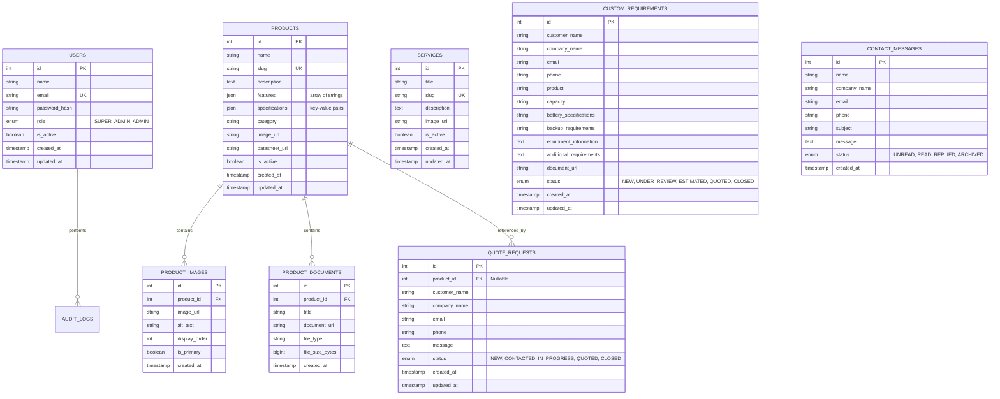

# GenesisConnect Database Schema Specification

## 1. Overview

The GenesisConnect persistence layer is powered by **PostgreSQL** using **SQLAlchemy 2.0** ORM. All entities follow strict relational integrity with UUID or auto-incrementing primary keys, UTC timestamp auditing (`created_at`, `updated_at`), foreign key constraints, and indexing on frequent query paths (such as `slug`, `email`, `status`, and `is_active`).

---

## 2. Entity Relationship Diagram (ERD)

---

## 3. Detailed Entity Dictionary

### 3.1 `User`
Manages authorized administrators accessing the GenesisConnect Admin Console.
* `id` (`Integer`, Primary Key, Auto-increment)
* `name` (`String(255)`, Not Null)
* `email` (`String(255)`, Unique, Indexed, Not Null)
* `password_hash` (`String(255)`, Not Null) — bcrypt hash
* `role` (`Enum('SUPER_ADMIN', 'ADMIN')`, Default: `'ADMIN'`, Not Null)
* `is_active` (`Boolean`, Default: `True`, Not Null)
* `created_at` (`DateTime(timezone=True)`, Server Default: `now()`)
* `updated_at` (`DateTime(timezone=True)`, On Update: `now()`)

### 3.2 `Product`
Master catalog items (Generators, Inverters, UPS, Transformers, Switchgear).
* `id` (`Integer`, Primary Key, Auto-increment)
* `name` (`String(255)`, Indexed, Not Null)
* `slug` (`String(255)`, Unique, Indexed, Not Null) — SEO friendly identifier
* `description` (`Text`, Nullable)
* `features` (`JSON`, Nullable) — List of highlight points (e.g. `["Low Noise", "High Fuel Efficiency"]`)
* `specifications` (`JSON`, Nullable) — Key-value dictionary (e.g. `{"Power": "250 kVA", "Phase": "3 Phase", "Engine": "Cummins"}`)
* `category` (`String(100)`, Indexed, Not Null)
* `image_url` (`String(512)`, Nullable) — Primary display image
* `datasheet_url` (`String(512)`, Nullable) — Primary technical PDF brochure
* `is_active` (`Boolean`, Default: `True`, Indexed, Not Null)
* `created_at` (`DateTime(timezone=True)`, Server Default: `now()`)
* `updated_at` (`DateTime(timezone=True)`, On Update: `now()`)

### 3.3 `ProductImage`
Allows multiple gallery images per product.
* `id` (`Integer`, Primary Key, Auto-increment)
* `product_id` (`Integer`, Foreign Key: `products.id`, On Delete: `CASCADE`, Not Null)
* `image_url` (`String(512)`, Not Null) — Supabase Storage public CDN URL
* `alt_text` (`String(255)`, Nullable)
* `display_order` (`Integer`, Default: 0)
* `is_primary` (`Boolean`, Default: `False`)
* `created_at` (`DateTime(timezone=True)`, Server Default: `now()`)

### 3.4 `ProductDocument`
Technical manuals, brochures, and compliance certifications.
* `id` (`Integer`, Primary Key, Auto-increment)
* `product_id` (`Integer`, Foreign Key: `products.id`, On Delete: `CASCADE`, Not Null)
* `title` (`String(255)`, Not Null)
* `document_url` (`String(512)`, Not Null) — Supabase Storage URL
* `file_type` (`String(50)`, Nullable) — e.g. `'PDF'`
* `file_size_bytes` (`BigInteger`, Nullable)
* `created_at` (`DateTime(timezone=True)`, Server Default: `now()`)

### 3.5 `Service`
Industrial services offered by Genesis Power Equipments (AMC, Overhauling, Installation, Rental).
* `id` (`Integer`, Primary Key, Auto-increment)
* `title` (`String(255)`, Not Null)
* `slug` (`String(255)`, Unique, Indexed, Not Null)
* `description` (`Text`, Nullable)
* `image_url` (`String(512)`, Nullable)
* `is_active` (`Boolean`, Default: `True`, Indexed, Not Null)
* `created_at` (`DateTime(timezone=True)`, Server Default: `now()`)
* `updated_at` (`DateTime(timezone=True)`, On Update: `now()`)

### 3.6 `QuoteRequest`
Customer quotation requests submitted from product pages or the general quote form.
* `id` (`Integer`, Primary Key, Auto-increment)
* `customer_name` (`String(255)`, Not Null)
* `company_name` (`String(255)`, Nullable)
* `email` (`String(255)`, Indexed, Not Null)
* `phone` (`String(50)`, Not Null)
* `product_id` (`Integer`, Foreign Key: `products.id`, Nullable, On Delete: `SET NULL`)
* `message` (`Text`, Nullable)
* `status` (`Enum('NEW', 'CONTACTED', 'IN_PROGRESS', 'QUOTED', 'CLOSED')`, Default: `'NEW'`, Indexed, Not Null)
* `created_at` (`DateTime(timezone=True)`, Server Default: `now()`)
* `updated_at` (`DateTime(timezone=True)`, On Update: `now()`)

### 3.7 `CustomRequirement`
Engineered requests for customized power solutions, custom battery banks, and specialized installations.
* `id` (`Integer`, Primary Key, Auto-increment)
* `customer_name` (`String(255)`, Not Null)
* `company_name` (`String(255)`, Nullable)
* `email` (`String(255)`, Indexed, Not Null)
* `phone` (`String(50)`, Not Null)
* `product` (`String(255)`, Nullable) — Equipment category or specific target model
* `capacity` (`String(100)`, Nullable) — e.g. "500 kVA", "1 MW"
* `battery_specifications` (`String(255)`, Nullable) — e.g. "SMF 12V 100Ah x 32"
* `backup_requirements` (`String(255)`, Nullable) — e.g. "4 Hours continuous load"
* `equipment_information` (`Text`, Nullable) — Machine loads, inductive surge details
* `additional_requirements` (`Text`, Nullable)
* `document_url` (`String(512)`, Nullable) — Customer-uploaded drawings/specs in Supabase Storage
* `status` (`Enum('NEW', 'UNDER_REVIEW', 'ESTIMATED', 'QUOTED', 'CLOSED')`, Default: `'NEW'`, Indexed, Not Null)
* `created_at` (`DateTime(timezone=True)`, Server Default: `now()`)
* `updated_at` (`DateTime(timezone=True)`, On Update: `now()`)

### 3.8 `ContactMessage`
General inquiries sent through the public contact form.
* `id` (`Integer`, Primary Key, Auto-increment)
* `name` (`String(255)`, Not Null)
* `company_name` (`String(255)`, Nullable)
* `email` (`String(255)`, Indexed, Not Null)
* `phone` (`String(50)`, Nullable)
* `subject` (`String(255)`, Nullable)
* `message` (`Text`, Not Null)
* `status` (`Enum('UNREAD', 'READ', 'REPLIED', 'ARCHIVED')`, Default: `'UNREAD'`, Indexed, Not Null)
* `created_at` (`DateTime(timezone=True)`, Server Default: `now()`)
