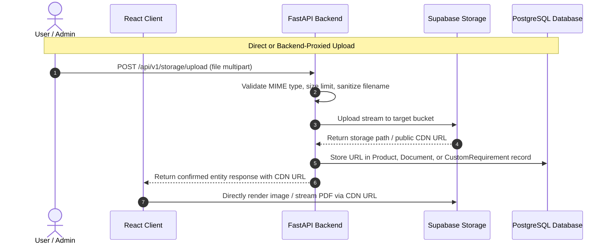

# GenesisConnect Supabase Storage Architecture Guide

## 1. Overview

To maintain optimal relational database performance, **GenesisConnect** decouples binary assets from PostgreSQL:
* Binary files (images, PDF datasheets, customer design specifications) are stored in **Supabase Storage**.
* Only the generated file URLs and asset metadata (dimensions, byte size, mime type) are persisted in PostgreSQL.

---

## 2. Storage Buckets

| Bucket Name | Access Policy | File Types Allowed | Max File Size | Use Case |
| :--- | :--- | :--- | :--- | :--- |
| `product-images` | **Public** Read | `image/jpeg`, `image/png`, `image/webp` | 5 MB | Product catalog primary photos, gallery images, service hero images. |
| `product-datasheets` | **Public** Read | `application/pdf` | 25 MB | Technical specification sheets, operation manuals, dimensional drawings. |
| `requirement-documents` | **Restricted / Private** | `application/pdf`, `image/*`, `application/zip` | 20 MB | Customer-uploaded site drawings, single-line diagrams, tender RFPs. |

---

## 3. Storage Flow

---

## 4. Bucket Security Policies (RLS)

1. **`product-images` & `product-datasheets`**:
   - `SELECT`: Allowed for public anon role (anyone visiting the website can view product photos and download datasheets).
   - `INSERT`, `UPDATE`, `DELETE`: Allowed only via service role key or authenticated admin JWT.
2. **`requirement-documents`**:
   - `INSERT`: Allowed for anonymous submissions with unique UUID filename prefixes.
   - `SELECT`: Restricted to authenticated admins to protect sensitive client engineering drawings.
